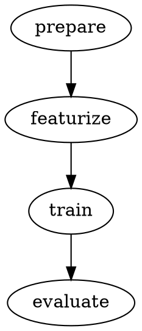
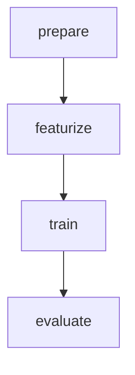

## Synopsis

```bash
dvc dag [options] [target]
```

## Description

The `dvc dag` command visualizes the structure of your DVC pipelines as a directed acyclic graph (DAG). It shows the relationships between stages, helping you understand data flow and dependencies in your project.

The DAG visualization displays:
- **Stages**: Nodes representing data processing steps
- **Dependencies**: Edges showing which stages depend on others
- **Pipeline structure**: Overall data flow from inputs to outputs

By default, `dvc dag` produces ASCII art output suitable for terminal viewing. It can also generate output in DOT format (for Graphviz) or Mermaid format (for documentation).

<Info>
  A DAG is a graph with directed edges and no cycles. In DVC pipelines, stages are nodes and dependencies are edges. The acyclic nature ensures pipelines can be executed in a valid order.
</Info>

## Arguments

<ParamField path="target" type="string">
  Stage name or output to show pipeline for. Finds all stages in the workspace by default.
  
  When specified, shows only the portion of the DAG related to this target.
  
  **Examples:**
  ```bash
  dvc dag train              # Show DAG for train stage
  dvc dag models/model.pkl   # Show DAG for specific output
  ```
</ParamField>

## Options

### Output Formats

<ParamField path="--dot" type="boolean">
  Print DAG in DOT format. DOT is a graph description language used by Graphviz.
  
  Output can be rendered to images using Graphviz tools:
  
  ```bash
  dvc dag --dot | dot -Tpng -o pipeline.png
  dvc dag --dot | dot -Tsvg -o pipeline.svg
  ```
</ParamField>

<ParamField path="--mermaid" type="boolean">
  Print DAG in Mermaid format. Mermaid is a JavaScript-based diagramming tool.
  
  The output can be used in:
  - Markdown files (GitHub, GitLab)
  - Documentation sites
  - Mermaid Live Editor
  
  ```bash
  dvc dag --mermaid
  ```
</ParamField>

<ParamField path="--md, --markdown" type="boolean">
  Print DAG in Mermaid format wrapped in Markdown code block.
  
  This format is ready to paste into Markdown files:
  
  ```bash
  dvc dag --md >> README.md
  ```
</ParamField>

### Filtering Options

<ParamField path="--full" type="boolean">
  Show full DAG that the target belongs to, instead of showing only ancestors.
  
  By default, when you specify a target, DVC shows only that stage and its dependencies (ancestors). With `--full`, it shows the entire pipeline including stages that don't affect the target.
  
  ```bash
  dvc dag --full train
  ```
</ParamField>

<ParamField path="-o, --outs" type="boolean">
  Print output files instead of stages.
  
  Shows the data artifacts DAG rather than the stage execution DAG.
  
  ```bash
  dvc dag --outs
  ```
  
  <Note>
    Cannot be used with `--collapse-foreach-matrix`.
  </Note>
</ParamField>

<ParamField path="--collapse-foreach-matrix" type="boolean">
  Collapse stages from each foreach/matrix definition into a single node.
  
  When using foreach or matrix to generate multiple similar stages, this option groups them into a single node for cleaner visualization.
  
  ```bash
  dvc dag --collapse-foreach-matrix
  ```
  
  <Note>
    Cannot be used with `--outs`.
  </Note>
</ParamField>

## Examples

### Basic DAG visualization

View the entire pipeline in ASCII format:

```bash
dvc dag
```

Output:
```
         +---------+
         | prepare |
         +---------+
              *
              *
              *
        +-----------+
        | featurize |
        +-----------+
         **        **
       **            *
      *               **
+-------+               *
| train |             **
+-------+            *
    *             **
    *           **
    *         *
+----------+
| evaluate |
+----------+
```

Each stage is represented as a box, with asterisks showing dependencies.

### Visualize specific stage and dependencies

```bash
dvc dag train
```

Output:
```
    +---------+
    | prepare |
    +---------+
         *
         *
         *
   +-----------+
   | featurize |
   +-----------+
         *
         *
         *
    +-------+
    | train |
    +-------+
```

Shows only `train` and the stages it depends on.

### Show full pipeline for a stage

```bash
dvc dag --full train
```

This shows the entire pipeline, including stages that come after `train` (like `evaluate`) that don't affect it.

### Generate DOT format for Graphviz

```bash
dvc dag --dot
```

Output:


### Create pipeline diagram image

Generate a PNG image of your pipeline:

```bash
dvc dag --dot | dot -Tpng -o pipeline.png
```

Or as SVG:

```bash
dvc dag --dot | dot -Tsvg -o pipeline.svg
```

<Tip>
  Install Graphviz with: `apt-get install graphviz` (Ubuntu) or `brew install graphviz` (macOS)
</Tip>

### Generate Mermaid diagram

```bash
dvc dag --mermaid
```

Output:


### Generate Mermaid diagram for documentation

```bash
dvc dag --md
```

Output:
```markdown

```

This output can be directly pasted into Markdown files and will render on GitHub, GitLab, and documentation sites.

### Add pipeline diagram to README

```bash
echo "## Pipeline Structure" >> README.md
dvc dag --md >> README.md
```

### Visualize data flow (outputs)

```bash
dvc dag --outs
```

Output:
```
   +------------------+
   | data/prepared.csv |
   +------------------+
            *
            *
            *
  +---------------------+
  | data/features.csv   |
  +---------------------+
      **            **
    **                **
   *                    **
+-----------------+       *
| models/model.pkl |    **
+-----------------+    *
         *          **
         *        **
         *      *
  +------------------+
  | metrics/eval.json |
  +------------------+
```

Shows data artifacts instead of stages.

### Collapse matrix stages

For pipelines using `foreach` or `matrix`, collapse repeated stages:

```bash
dvc dag --collapse-foreach-matrix
```

Before:
```
+------------------+
| train@model=lstm |
+------------------+

+------------------+
| train@model=gru  |
+------------------+

+------------------+
| train@model=rnn  |
+------------------+
```

After:
```
+-------+
| train |
+-------+
```

## Understanding Pipeline Structure

### Simple linear pipeline

```yaml
# dvc.yaml
stages:
  prepare:
    cmd: python prepare.py
    outs:
      - data/prepared.csv
  
  train:
    cmd: python train.py
    deps:
      - data/prepared.csv
    outs:
      - model.pkl
```

```bash
dvc dag
```

Output:
```
+---------+
| prepare |
+---------+
     *
     *
     *
+-------+
| train |
+-------+
```

### Branching pipeline

```yaml
stages:
  prepare:
    cmd: python prepare.py
    outs:
      - data/prepared.csv
  
  train:
    cmd: python train.py
    deps:
      - data/prepared.csv
    outs:
      - model.pkl
  
  baseline:
    cmd: python baseline.py
    deps:
      - data/prepared.csv
    outs:
      - baseline.pkl
```

```bash
dvc dag
```

Output:
```
        +---------+
        | prepare |
        +---------+
         **        **
       **            **
      *                *
+-------+          +----------+
| train |          | baseline |
+-------+          +----------+
```

### Converging pipeline

```yaml
stages:
  prepare:
    cmd: python prepare.py
    outs:
      - data.csv
  
  train:
    cmd: python train.py
    deps:
      - data.csv
    outs:
      - model.pkl
  
  evaluate:
    cmd: python evaluate.py
    deps:
      - data.csv
      - model.pkl
    metrics:
      - metrics.json
```

```bash
dvc dag
```

Output:
```
    +---------+
    | prepare |
    +---------+
     **        **
   **            *
  *               *
+-------+          *
| train |          *
+-------+          *
    *              *
    *            **
    *          **
    +----------+
    | evaluate |
    +----------+
```

## Use Cases

### Documentation

Embed pipeline diagrams in your project documentation:

```bash
dvc dag --md > docs/pipeline.md
```

### Code reviews

Generate visual representation for pull requests:

```bash
dvc dag --dot | dot -Tpng -o pipeline.png
git add pipeline.png
```

### Debugging pipelines

Understand execution order and dependencies:

```bash
# See what depends on a specific stage
dvc dag train

# See the full pipeline context
dvc dag --full train
```

### Pipeline optimization

Identify opportunities for parallelization:

```bash
dvc dag
```

Stages at the same level with no dependencies between them can run in parallel.

### Tracking data lineage

Visualize data flow through your pipeline:

```bash
dvc dag --outs
```

Shows which outputs depend on which inputs.

## Output Format Details

### ASCII Format

- Default format
- Displayed in terminal with pagination
- Boxes represent stages
- Asterisks (*) represent dependencies
- Suitable for quick checks

### DOT Format

- Industry-standard graph format
- Processed by Graphviz tools
- Can generate: PNG, SVG, PDF, PS
- Highly customizable with DOT syntax
- Best for publication-quality diagrams

**Example customization:**
```bash
dvc dag --dot > pipeline.dot
# Edit pipeline.dot to customize appearance
dot -Tpng pipeline.dot -o pipeline.png
```

### Mermaid Format

- Modern JavaScript-based diagramming
- Renders in Markdown (GitHub, GitLab)
- Interactive in documentation sites
- No external tools needed
- Best for documentation

**Supported platforms:**
- GitHub (in .md files)
- GitLab (in .md files)
- Mintlify, MkDocs, Docusaurus
- Mermaid Live Editor
- Notion, Obsidian

## Integration Examples

### GitHub Actions

Automatically update pipeline diagram:

```yaml
name: Update Pipeline Diagram

on:
  push:
    paths:
      - 'dvc.yaml'

jobs:
  update-diagram:
    runs-on: ubuntu-latest
    steps:
      - uses: actions/checkout@v2
      - uses: iterative/setup-dvc@v1
      - name: Generate diagram
        run: |
          dvc dag --md > docs/pipeline.md
          git add docs/pipeline.md
          git commit -m "Update pipeline diagram" || exit 0
          git push
```

### Pre-commit hook

Keep documentation in sync:

```bash
# .git/hooks/pre-commit
#!/bin/bash
dvc dag --md > docs/pipeline.md
git add docs/pipeline.md
```

### Makefile integration

```makefile
.PHONY: pipeline-diagram
pipeline-diagram:
	dvc dag --dot | dot -Tpng -o docs/images/pipeline.png
	
docs: pipeline-diagram
	mkdocs build
```

## Advanced Tips

<Tip>
  **Compare pipelines**: Generate DAGs from different branches to visualize pipeline changes:
  ```bash
  git show main:dvc.yaml > /tmp/main-dvc.yaml
  dvc dag --dot > current.dot
  # Switch to main branch
  dvc dag --dot > main.dot
  diff current.dot main.dot
  ```
</Tip>

<Tip>
  **Automated diagram generation**: Set up CI/CD to automatically generate and publish pipeline diagrams when `dvc.yaml` changes.
</Tip>

<Info>
  **Large pipelines**: For very large pipelines, consider using `--collapse-foreach-matrix` or filtering with specific targets to improve readability.
</Info>

## Troubleshooting

### Empty output

If `dvc dag` produces no output:
- Ensure you have a `dvc.yaml` file with stages
- Check that you're in a DVC repository (`dvc status`)
- Verify the target exists if you specified one

### Graphviz not found

If `dot` command is not available:
```bash
# Ubuntu/Debian
sudo apt-get install graphviz

# macOS
brew install graphviz

# Windows
choco install graphviz
```

### Mermaid rendering issues

If Mermaid diagrams don't render in Markdown:
- Ensure platform supports Mermaid (GitHub, GitLab do)
- Check for syntax errors in the output
- Try using the Mermaid Live Editor for testing

### Complex pipeline visualization

For complex pipelines:
- Use `--collapse-foreach-matrix` to simplify
- Filter with specific targets: `dvc dag train`
- Generate multiple diagrams for different sections

## See Also

- [dvc stage list](/commands/stage) - List stages in text format
- [dvc repro](/commands/repro) - Execute pipelines
- [dvc status](/commands/status) - Check pipeline status
- [dvc pipelines](/commands/pipelines) - Pipeline management commands