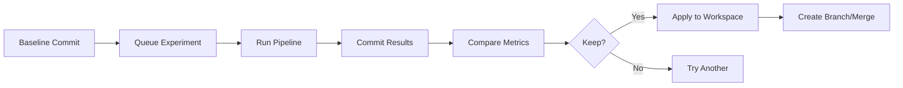

## What are Experiments?

Experiments in DVC allow you to run multiple variations of your pipeline with different parameters, code changes, or data, while automatically tracking all results. Each experiment is a Git commit that DVC manages separately, keeping your main branch clean while preserving full reproducibility.

<Info>
**Key Concept**: Experiments are Git commits in a special namespace (`refs/exps/`) that don't clutter your branch history. They capture code, parameters, metrics, and outputs for each run.
</Info>

## Why Experiments Matter

- **Rapid iteration**: Try many parameter combinations without manual bookkeeping
- **Complete tracking**: Automatically capture code, params, metrics, and outputs
- **Comparison**: Compare results across experiments in tables and plots
- **Collaboration**: Share experiment results with your team
- **Clean history**: Keep your main branch clean while tracking all attempts

## How Experiments Work

DVC experiments are built on Git's reference system and DVC's pipeline capabilities. The implementation is in `dvc/repo/experiments/__init__.py`.

### Experiment Lifecycle



### Running an Experiment

The simplest way to run an experiment:

```bash
dvc exp run
```

This executes your pipeline and creates an experiment commit with:
- Current code state
- Parameter values from `params.yaml`
- All pipeline outputs
- Metrics and plots

From `dvc/repo/experiments/run.py:14-113`, the implementation:

```python
@locked
def run(
    repo,
    targets: Optional[Iterable[str]] = None,
    params: Optional[Iterable[str]] = None,
    run_all: bool = False,
    jobs: int = 1,
    tmp_dir: bool = False,
    queue: bool = False,
    copy_paths: Optional[Iterable[str]] = None,
    message: Optional[str] = None,
    **kwargs,
) -> dict[str, str]:
    """Reproduce the specified targets as an experiment.
    
    Returns a dict mapping new experiment SHAs to the results
    of `repro` for that experiment.
    """
```

### Parameter Overrides

Run experiments with different parameters without editing files:

```bash
dvc exp run --set-param train.learning_rate=0.001
dvc exp run --set-param train.epochs=100 --set-param model.layers=5
```

Shorthand:
```bash
dvc exp run -S learning_rate=0.001 -S epochs=100
```

DVC temporarily modifies `params.yaml`, runs the pipeline, and commits everything.

<Note>
Parameter paths use dot notation: `section.subsection.param` maps to YAML structure.
</Note>

## Experiment Storage

Experiments are stored as Git references in a special namespace. From `dvc/repo/experiments/refs.py`:

```python
EXPS_NAMESPACE = "refs/exps"
EXEC_NAMESPACE = "refs/exps/exec"
WORKSPACE_STASH = f"{EXEC_NAMESPACE}/EXEC_HEAD"
```

Structure:
```
refs/exps/
├── <baseline-commit-sha>/
│   ├── <exp-name-1>
│   ├── <exp-name-2>
│   └── <exp-name-3>
└── exec/
    └── EXEC_HEAD  # Currently running experiment
```

This keeps experiments:
- **Associated with baseline**: Each experiment links to its parent commit
- **Isolated from branches**: Won't appear in `git log` or `git branch`
- **Persistent**: Stored in `.git/refs/exps/`
- **Shareable**: Can be pushed to remote Git servers

## The Experiments Class

The core experiments manager is defined in `dvc/repo/experiments/__init__.py:43-58`:

```python
class Experiments:
    """Class that manages experiments in a DVC repo.
    
    Args:
        repo (dvc.repo.Repo): repo instance that these experiments belong to.
    """
    
    BRANCH_RE = re.compile(r"^(?P<baseline_rev>[a-f0-9]{7})-(?P<exp_sha>[a-f0-9]+)")
    
    def __init__(self, repo):
        from dvc.scm import NoSCMError
        
        if repo.config["core"].get("no_scm", False):
            raise NoSCMError
        
        self.repo = repo
```

### Experiment Queue

Queue multiple experiments to run sequentially or in parallel:

```bash
dvc exp run --queue -S learning_rate=0.001
dvc exp run --queue -S learning_rate=0.01
dvc exp run --queue -S learning_rate=0.1
```

Then run all queued experiments:
```bash
dvc queue start
```

Or run with multiple workers:
```bash
dvc queue start --jobs 4
```

The queue implementation uses different backends from `dvc/repo/experiments/queue/`:
- **WorkspaceQueue**: Runs in current workspace
- **TempDirQueue**: Runs in temporary directories
- **LocalCeleryQueue**: Distributes via Celery workers

<Accordion title="Queue Implementation Details">
From `dvc/repo/experiments/__init__.py:79-97`:

```python
@cached_property
def workspace_queue(self) -> "WorkspaceQueue":
    from .queue.workspace import WorkspaceQueue
    return WorkspaceQueue(self.repo, WORKSPACE_STASH)

@cached_property
def tempdir_queue(self) -> "TempDirQueue":
    from .queue.tempdir import TempDirQueue
    # NOTE: tempdir and workspace stash is shared
    return TempDirQueue(self.repo, WORKSPACE_STASH)

@cached_property
def celery_queue(self) -> "LocalCeleryQueue":
    from .queue.celery import LocalCeleryQueue
    return LocalCeleryQueue(self.repo, CELERY_STASH, CELERY_FAILED_STASH)
```
</Accordion>

## Comparing Experiments

View experiment results in a table:

```bash
dvc exp show
```

Output:
```
┏━━━━━━━━━━━━━━━┳━━━━━━━━━━━┳━━━━━━━━━┳━━━━━━━━┳━━━━━━━━━━┓
┃ Experiment    ┃ Created   ┃ loss    ┃ acc    ┃ lr       ┃
┡━━━━━━━━━━━━━━━╇━━━━━━━━━━━╇━━━━━━━━━╇━━━━━━━━╇━━━━━━━━━━┩
│ workspace     │ -         │ 0.1543  │ 0.9234 │ 0.01     │
│ main          │ 12:41 PM  │ 0.2103  │ 0.8891 │ 0.001    │
│ ├── exp-a1b2c │ 12:45 PM  │ 0.1876  │ 0.9012 │ 0.005    │
│ └── exp-d3e4f │ 12:50 PM  │ 0.1543  │ 0.9234 │ 0.01     │
└───────────────┴───────────┴─────────┴────────┴──────────┘
```

Compare specific experiments:
```bash
dvc exp diff exp-a1b2c exp-d3e4f
```

<Tip>
Use `dvc exp show --only-changed` to see only metrics/params that differ between experiments.
</Tip>

## Experiment Naming

Name your experiments for easier reference:

```bash
dvc exp run --name "high-lr-experiment"
dvc exp run -n "reduced-regularization"
```

Named experiments are easier to identify:
```bash
dvc exp show
dvc exp apply high-lr-experiment
dvc exp remove reduced-regularization
```

The naming implementation validates names in `dvc/repo/experiments/utils.py:check_ref_format` to ensure valid Git references.

## Applying Experiments

When you find a good experiment, apply it to your workspace:

```bash
dvc exp apply exp-a1b2c
```

This:
1. Restores code from the experiment commit
2. Updates `params.yaml` to experiment values
3. Checks out pipeline outputs from cache
4. Updates metrics files

<Warning>
**Important**: `dvc exp apply` modifies your workspace but doesn't commit. Review changes, then commit to persist them.
</Warning>

To create a branch from an experiment:
```bash
dvc exp branch exp-a1b2c experiment-branch
```

This creates a regular Git branch, making the experiment part of your normal history.

## Experiment Cleanup

Remove experiments you don't need:

```bash
# Remove specific experiment
dvc exp remove exp-a1b2c

# Remove all experiments
dvc exp remove --all

# Remove experiments from specific baseline
dvc exp remove --rev main
```

From `dvc/repo/experiments/remove.py`, the implementation handles cleanup of Git refs and associated data.

## Checkpoints (Experiment Snapshots)

For long-running training, save intermediate results:

```python
# In your training script
from dvclive import Live

with Live() as live:
    for epoch in range(100):
        # Training code...
        live.log_metric("loss", loss)
        live.next_step()  # Creates checkpoint
```

Each checkpoint becomes a separate experiment you can compare and apply.

## Experiment Cache

Experiments have their own cache separate from the main DVC cache. From `dvc/repo/experiments/__init__.py:103-105`:

```python
@cached_property
def cache(self) -> ExpCache:
    return ExpCache(self.repo)
```

This enables:
- Fast experiment switching without re-downloading data
- Isolated experiment outputs
- Efficient storage of experiment variations

## Grid Search and Sweeps

Run experiments across parameter ranges using Hydra:

```bash
dvc exp run --queue -S 'learning_rate=0.001,0.01,0.1'
dvc exp run --queue -S 'learning_rate=range(0.001,0.1,0.01)'
```

From `dvc/repo/experiments/run.py:58-95`:
```python
hydra_sweep = any(
    x.is_sweep_override()
    for param_file in path_overrides
    for x in to_hydra_overrides(path_overrides[param_file])
)

if hydra_sweep and not queue:
    raise InvalidArgumentError(
        "Sweep overrides can't be used without `--queue`"
    )
```

This queues multiple experiments, one for each parameter combination.

## Experiment Tables

Customize what's shown in `dvc exp show`:

```bash
# Show specific metrics
dvc exp show --include-metrics loss,accuracy

# Show specific params
dvc exp show --include-params train.lr,train.epochs

# Sort by metric
dvc exp show --sort-by loss

# Show only running or queued experiments
dvc exp show --queued
```

## Baseline Commits

Each experiment is associated with a baseline commit. From `dvc/repo/experiments/__init__.py:256-289`:

```python
def check_baseline(self, exp_rev):
    baseline_sha = self.repo.scm.get_rev()
    if exp_rev == baseline_sha:
        return exp_rev
    
    exp_baseline = self._get_baseline(exp_rev)
    if exp_baseline is None:
        # if we can't tell from branch name, fall back to parent commit
        exp_commit = self.scm.resolve_commit(exp_rev)
        if exp_commit:
            exp_baseline = first(exp_commit.parents)
    if exp_baseline == baseline_sha:
        return exp_baseline
    raise BaselineMismatchError(exp_baseline, baseline_sha)
```

This ensures experiments are only applied to compatible commits, preventing confusion.

## Remote Experiments

Push experiments to remote Git servers:

```bash
dvc exp push origin exp-a1b2c
dvc exp push origin --all
```

Pull experiments from remote:
```bash
dvc exp pull origin exp-a1b2c
dvc exp list origin
```

<CardGroup cols={2}>
  <Card title="Share with Team" icon="users">
    Experiments can be shared via Git remotes, enabling collaborative experimentation
  </Card>
  
  <Card title="CI/CD Integration" icon="gears">
    Run experiments in CI pipelines and automatically track results
  </Card>
</CardGroup>

## Temporary Directory Experiments

Run experiments without modifying your workspace:

```bash
dvc exp run --temp
```

DVC creates a temporary directory, runs the experiment there, and cleans up afterward. Your workspace remains unchanged.

From `dvc/repo/experiments/__init__.py:114-132`:
```python
def reproduce_one(
    self,
    tmp_dir: bool = False,
    copy_paths: Optional[list[str]] = None,
    message: Optional[str] = None,
    **kwargs,
):
    """Reproduce and checkout a single (standalone) experiment."""
    exp_queue: BaseStashQueue = (
        self.tempdir_queue if tmp_dir else self.workspace_queue
    )
```

## Related Commands

- [`dvc exp run`](/commands/exp-run) - Run an experiment
- [`dvc exp show`](/commands/exp-show) - Display experiments table
- [`dvc exp diff`](/commands/exp-diff) - Compare experiments
- [`dvc exp apply`](/commands/exp-apply) - Apply experiment to workspace
- [`dvc exp branch`](/commands/exp-branch) - Create branch from experiment
- [`dvc queue`](/commands/queue) - Manage experiment queue

## Next Steps

<CardGroup cols={2}>
  <Card title="Pipelines" href="/concepts/pipelines" icon="diagram-project">
    Understand the pipeline system that experiments run on
  </Card>
  
  <Card title="Remote Storage" href="/concepts/remote-storage" icon="cloud">
    Share experiment outputs with your team
  </Card>
</CardGroup>